# GAMES101
The assignments of GAME101 (Introduction to Computer Graphics) whose instructor is Lingqi Yan, if you are interested, please refer to [lecture website](https://sites.cs.ucsb.edu/~lingqi/teaching/games101.html) for more information. this lecture mainly includes four parts: rasterization, geometry, ray tracing and animation. (shown as the following four pictures)


## Assignment 0: Configure Assignments Environment

### Install Eigen
In the assignemnts of this lecture, Eigen is used for mathematics related calculation, such as dot product, cross product, linear transformation, projection transformation, and so on. so Eigen should be installed beforehand. If you want to know more about Eigen, please go to [Eigen website](https://eigen.tuxfamily.org/index.php?title=Main_Page) for more details. installing Eigen is straightforward. following these steps will be fine:
- Download Eigen. Go to [Eigen offical website](https://eigen.tuxfamily.org/index.php?title=Main_Page), select a latest stable version, and download it.
- Install Eigen. Upzip the package, follow the instructions in the INSTALL file which is under the root directory to install Eigen to the system path. then you can refer to Eigen header files in your code just like this:
```C++
#include<eigen3/Eigen/Core>
#include<eigen3/Eigen/Dense>
```

### Install OpenCV
To show the rendering result, We select OpenCV to do some pixel-level processing, you can go to [OpenCV Documents](https://docs.opencv.org/4.x/d0/db2/tutorial_macos_install.html), and follow these steps listed there to install OpenCV, it may take several minutes to compile the source codes, be patient! after installing OpenCV successfully, you may include the OpenCV header files and enjoy it:
```C++
#include <opencv2/opencv.hpp>
```

### Configure VSCode
On the other hand, using VSCode as our developing environment is highly recommended. the configuration corresponding to VSCode is under the .vscode directory in the root directory of every assignment. I only add the configuration for Mac OS System.(sorry about that)

After installing Eigen and OpenCV, make sure adding the include directory in the CMakeList.txt file, so that your compiler can find the header file.

```
include_directories(/usr/local/include)
include_directories(/usr/local/include/opencv4)
```

Of course, the packages should be added too.

```
find_package(OpenCV REQUIRED)
find_package(Eigen3 REQUIRED)
```

## Assignment 1: Rotation And Projection

In this assignment, we need to implement three basic transformations: rotation about Z-axis, perspective projection and rotation about arbitrary axis passing through origin.

Rotation about Z-axis is straightforward, we just apply rotation to the three basis [1, 0, 0], [0, 1, 0], [0, 0, 1], and fill the three columns of the matrix with these three new basis, then leave the four column of the matrix with translation which is [0, 0, 0].

Computing perspective projection matrix is a little tricky, there are two mistakes it's prone to make, the first one is perspective division, what x- and y-coordinate need to divide is positive z-coordinate, rather than negative z-coordinate, on the other hand, what the camera can see is the coordinate whose z-coordinate is negative, so we need to transform it to a positive one. therefore we need get a homogoneous coordinate whose w is -z after applying the projection transformation, that is to say, the four row of the transformation is [0, 0, -1, 0], instead of [0, 0, 1, 0]. the second one is correctly computing the mapping from [zNear, zFar] to [-1, 1]，we need solve this equation:
```latex
-a * zNear + b = -zNear
-a * zFar + b = zFar
```

To compute a rotation matrix about arbitrary axis passing through origin, you need only follow three steps:
- Transform to the standard orthogonal basis.
- Apply the rotation.
- Transform back.

To compute the matrix which we need to transform to the standard orthogonal basis, we need to build a new orthogonal basis, using the rotation axis as the z-axis, and calculate x-axis and y-axis, there are a lot of them, as long as x-axis, y-axis and z-axis are orthogonal to each other, and then set these three axis as the first three columns of the objective matrix. note that if a matrix is orthogornal matrix, you can calculate its inverse matrix by just transpose it which is fast.


## Assignment 2: Triangles And Z-buffering

The architecture provided by this assignment has done a lot for us. what left to us to do is just solving the visibility problem with the help of depth buffer. another problem is to judge whether a given point is in a triangle or not, which can be solved easily by calculating whether the point is all on the same side of the threes lines of the triangle using cross product.

Another point worth mentioning is how to compute the perspective-correct interpolation, although this homework has already handled this problem for us, it's worthwhile to take some time to figure out how it works. such as how the z-coordinate is correctly interpolated, and how the attributes of the vertex is interpolated. If you want to know more, you can refer to ***Mathematics for 3D Game Programming and Computer Graphics, Third Edition***, this book gives a very elegant and easy-to-understand explanation.

SSAA(Super Sampling Anti-Aliasing) implementation is trival, a nice way is to just double the size of the frame buffer and the depth buffer, and after rasterization, down-sample the double-sized frame buffer to a normal size. 

Triangle without and with super sampling:

 

## Assignment 3: Pipeline and Shading

There are three mistakes existing in this assignment:
- In the implementation of blinn-phong shading model, (0, 0, 10) is used as the camera pos, which is wrong, as in the camera coordiniate, the camera pos should be at the origin.
- the essence of dispalcement map is adding some offset to vertex position according to the displacement map, rather than to pixel position.
- In the calculation of TBN transformation, the procedure of computing B is unreasonable. the B and T's direction should be consistent with the direction of U and V of the bump map respectively, only in this way, can the finite difference dU and dV make sense. If you want to know more, [LearnOpenGL](https://learnopengl.com/Advanced-Lighting/Normal-Mapping) gives a correct computation.

Normal visualization and Blinn-Phong shading model:

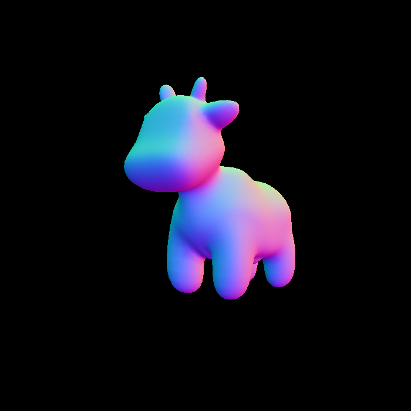 

Bump map and Displacement map:

 

Texture nearest vs bilinear interpolation:

 

## Assignment 4: Bézier Curve

This assignment is trival, it takes only several minutes to implement de Casteljau's algorihtm. the more interesting part is how to achieve anti-aliasing. here I not only assign the specified pixel a color, but also interpolate the surrounding eight pixels with one half the color. Take care not overwrite the ones which already have a value.

Bézier curve without and with anti-aliasing:

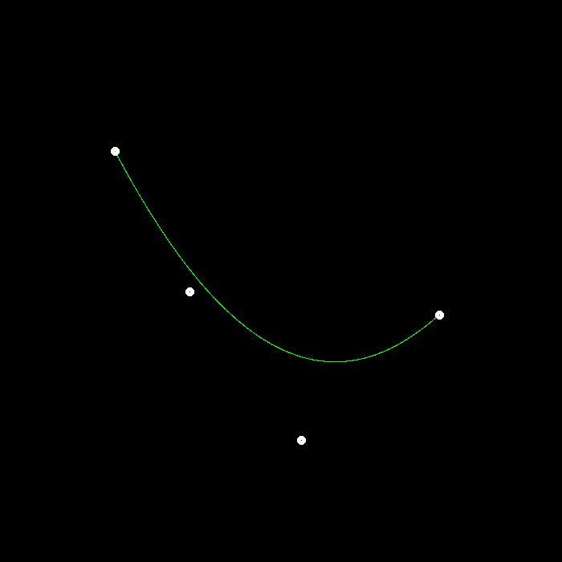 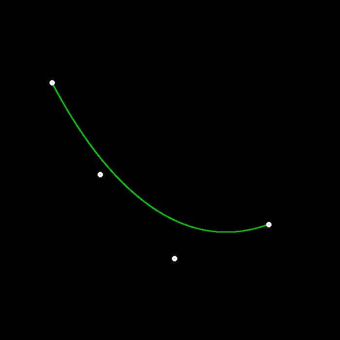

## Assignment 5: Ray Generation And Intersection With Triangles

Here we use Moller-Trumbore algorithm to judge whether a ray is intersected with a triangle, if intersected, the barycentric coordinate of the intersection point will be given, the three components of the barycentric coordinate should be non-negative, otherwise the triangle is missed. in the process of this algorithm, we need to solve a ***Ax = b*** equation, a general way to solve a low dimensional equation is [Cramer's Rule](https://math.libretexts.org/Bookshelves/Precalculus/Precalculus_(OpenStax)/09%3A_Systems_of_Equations_and_Inequalities/9.08%3A_Solving_Systems_with_Cramer's_Rule), in this rule, the determinants of n + 1 (n is the dimension of ***x***) matrices is needed beforehand. for a 3x3 matrix ***A***[c1 c2 c3] (c1 c2 c3 are the three columns of the matrix), a quick way to compute its determinant is dot(cross(c1, c2), c3).

An error occurred when saving the rendered image to a ppm file in the base code of this assignment, which is triggered by overflow of assigning a unsigned char whose range is (0, 255) to a char whose range is (-127, 128). modifying the conversion from char to unsigned char will solve this issue.

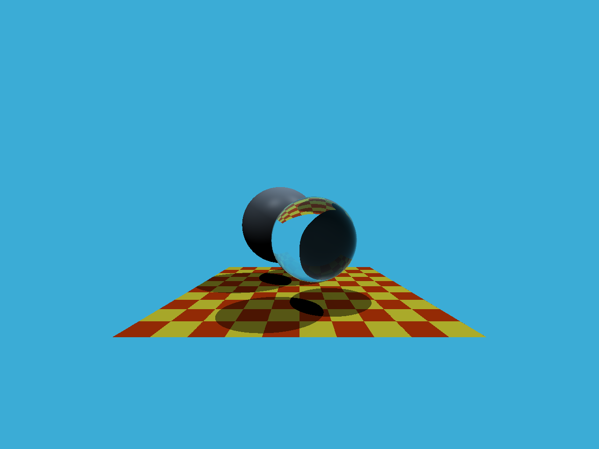

## Assignment 6: BVH Acceleration

In this assignment, I have implemented both a naive BVH and a SAH (Surface Area Heuristic) based BVH, after that, I compared both methods' speed on my computer (macOS Big Sur 16GB 2.6GHz 6-Core Intel Core i7) from two dimensions, one is the time to construct BVH tree, the other is the time to render a bunny model using the acceleration structure. the times using naive BVH are 13ms and 784ms respectively, compared to that, It spends both 49ms and 428ms with SAH based BVH. Then we can draw a conclusion that SAH based BVH is much better than the naive one to accelerate intersections.


## Assignment 7: Path Tracing
Because that it may take a long time to finish rendering an image with path tracing algorithm, you may want to accelerate it. Here are several tips:
- employ 1 spp at the start time.
- decrease the number of meshes.
- keep the ray's bouncing time fewer.

My advice for this assignment is implementing it step by step, The point is to keep the influence factor as less as possible. you may divide the problem into smaller ones just as I do, and conquer them respectively, in order to keep the complexity as low as possible. Make sure the former one works fine, then continue with the next one. Here are the steps when I try to finish the assignment:
- show the intersection's normal as shading point's color, to make sure you correctly compute the intersection with the scene as well as the intersection's information.
- render the light source with no bounce.
- render the direct lighting.
- render the indirect lighting.

you are fate to come across the self-intersection problem when you shoot secondary ray or shadow ray. more precisely, if you shoot a secondary ray from an object you may intersect the object itself because of float-precision issue, or you may intersect the light source itself when you check whether there is a blocker between the shading point and the light source. My solution to the first problem is just offset the start point of the ray across the normal directoin a little bit. and the solution to the second one is to just check if the object intersected is the light source itself, if not, we're certain that there is no blocker between the shading point and the light source.

normal visualization:

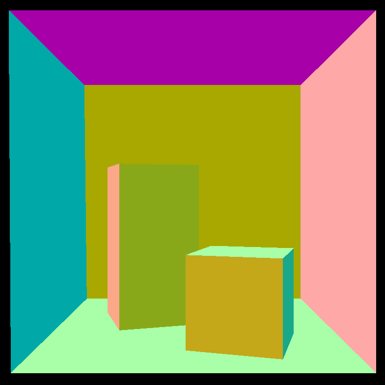

light with no bounce:

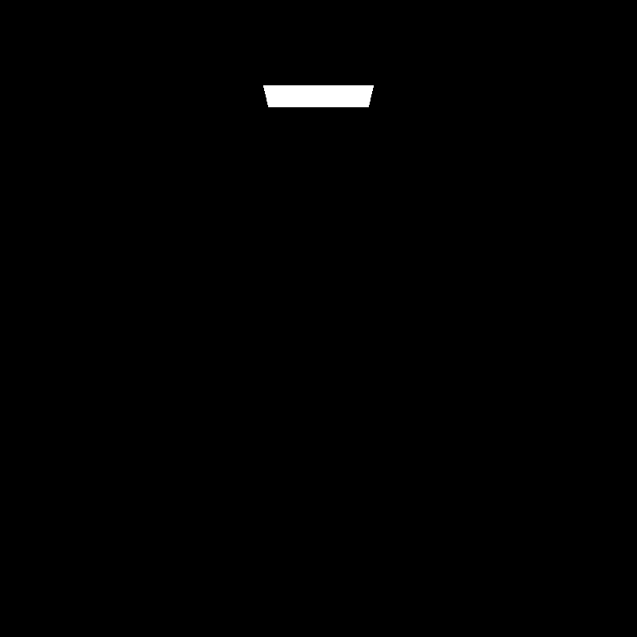

direct lighting:

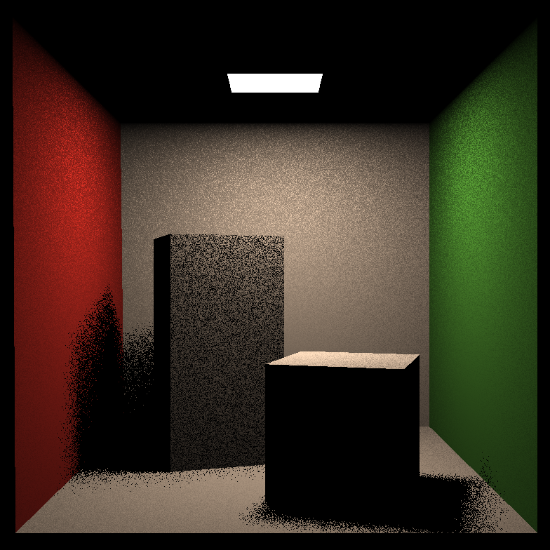

path tracing with 1 and 16 spp respectively:

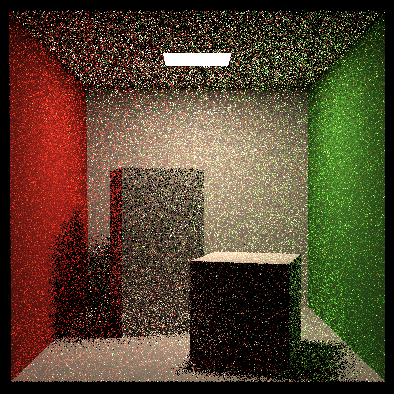 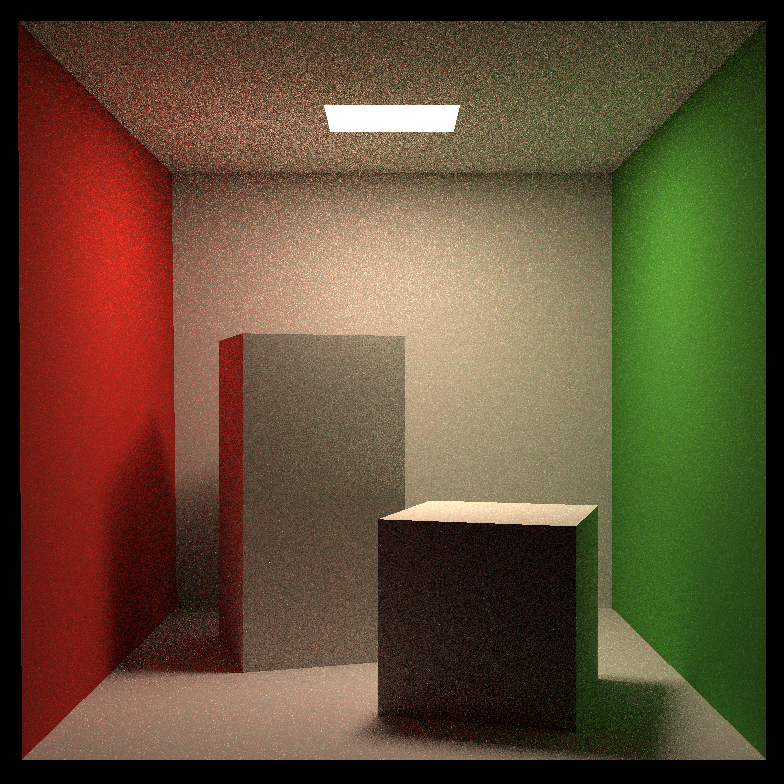

mirror and glass material with 1 spp respectively:

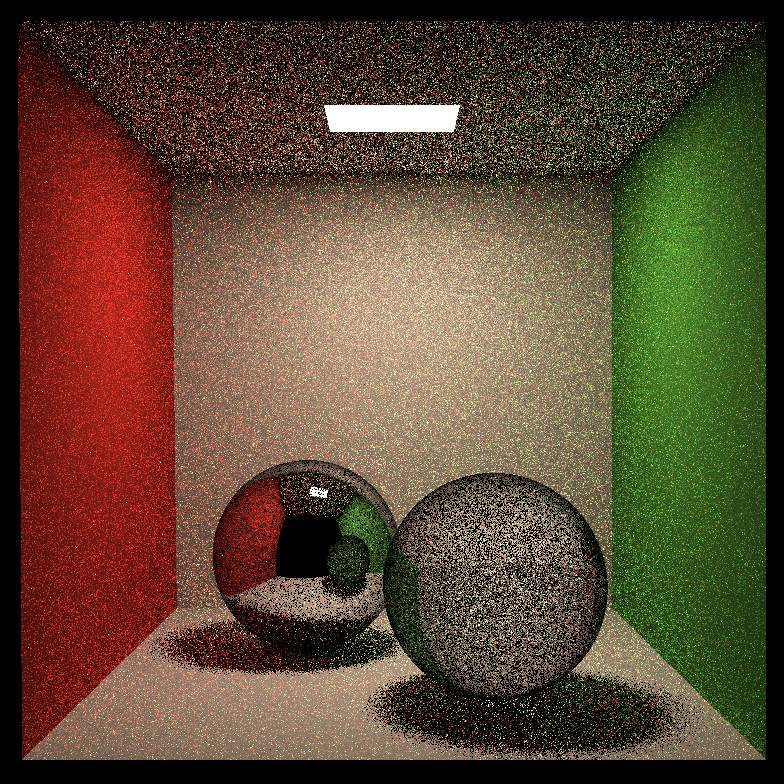 

## Assignment 8: Mass-Spring System

This assignment is straightforward, the key point is just calculating the direction and magnitude of the force correctly.

explicit Euler and Verlet:

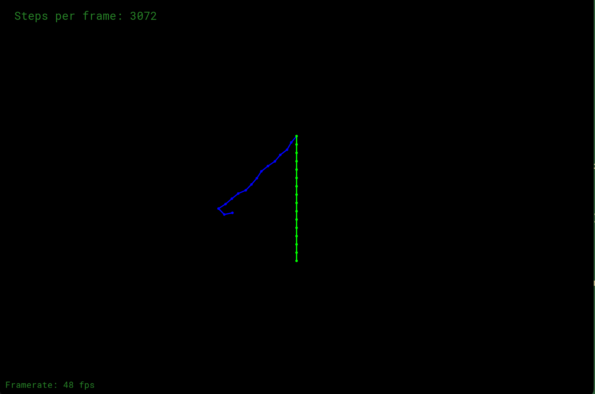
